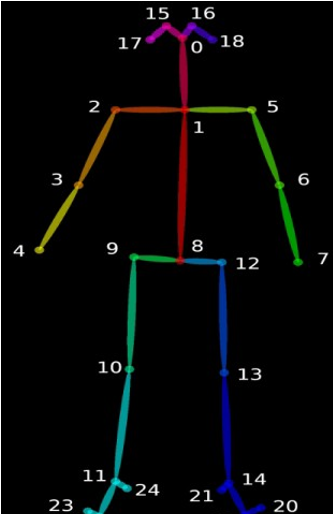
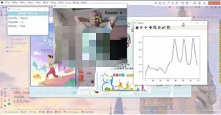

# PoseDetect

## Project Significance 📚
With the improvement of people's living standards, especially since the pandemic, there has been a growing emphasis on physical exercise. However, it is often challenging for individuals to assess their workout intensity accurately. Our project aims to assist users by counting repetitions and measuring the rate during exercises such as push-ups, sit-ups, and more. After a workout, users can clearly see their exercise volume, providing them with a better understanding of their physical activity.

Additionally, users can control their workout volume by setting goals based on time or repetition count, allowing them to maximize their workout efficiency.

Our project is capable of counting multiple exercise postures (e.g., push-ups, sit-ups, etc.), not just a single type of exercise. This flexibility meets users' diverse workout needs, supporting a variety of exercise routines.

## Project Content 📊

### First Part
Environment Setup: Installation of the OpenPose model (an open-source library developed by Carnegie Mellon University based on convolutional neural networks and supervised learning, using Caffe as the framework, capable of estimating human poses, facial expressions, and finger movements). Setting up and configuring the PyQt5 environment.

### Second Part
Human Keypoint Detection: Using the camera feed, the OpenPose model is called to detect human keypoints, connecting key points to form an entire skeletal structure.



### Third Part
Counting Functionality: The camera continuously detects frames in real-time to calculate changes in human keypoints, displaying the exercise name, count, and status in the workout window to track repetitions. It provides real-time angle detection for push-ups and displays fluctuation graphs of coordinate changes for squats and jump rope. There is voice guidance throughout the exercise, assisting users as they work out.


### Fourth Part
Program Development: Using PyQt5 to design the user interface, which includes background images, animations, and instructional text for an aesthetically pleasing display. Users can select the exercise they wish to perform. The interface offers timed and quantified training for 12 types of exercises (jump rope, squats, sit-ups, push-ups, pull-ups, crunches, etc.).


## Project Highlights ✨

### Highlight 1
In the design of the program page, radio buttons were used instead of push buttons, allowing users to intuitively select the training they want to perform. Many icons downloaded from IconPark were applied to the push buttons, enhancing the visual appeal of the interface. The page also features motivational slogans promoting fitness and animated warm-up exercises, encouraging users to warm up under these inspiring messages. The program's icon incorporates the avatars of our four team members, adding a sense of copyright ownership.

### Highlight 2
The original model's output point colors were too monotonous. We enhanced the appearance of the detection points from the original OpenPose model by adding color fills and connecting them, making it visually more appealing.

### Highlight 3
We implemented a real-time voice broadcasting function that announces exercise analysis results, guiding users and improving their overall experience.

### Highlight 4
Data is captured in real time via the camera, with a display of the count and a curve graph showing changes in coordinates. Videos are automatically saved to the local drive, allowing users to conveniently review their exercise progress.

### Highlight 5
A variety of exercise types are available, with features for timed and quantified training. Users can input an end time or desired exercise duration, or specify the amount of exercise, providing them with more choices and enhancing the program's functionality.

### Requirements 📋
You can quickly install the corresponding dependencies,

```bash
pip install -r requirements.txt
```
